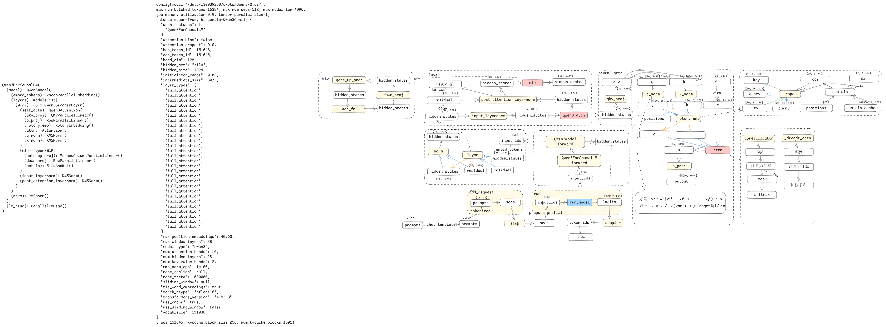
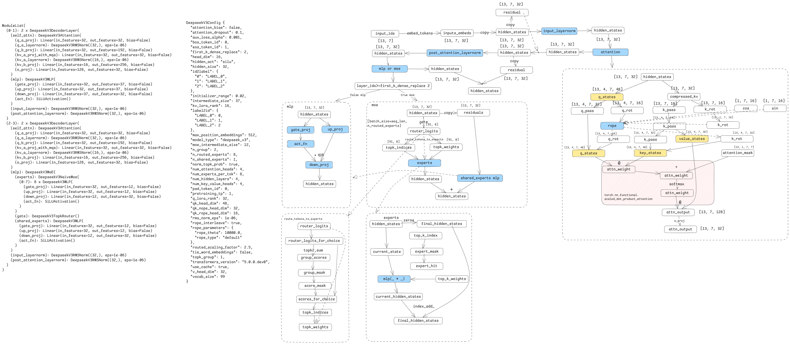

## 1 sglang
### 1.1 sglang框架图
v0.5.5 post3
参考 https://github.com/zhaochenyang20/Awesome-ML-SYS-Tutorial/blob/main/sglang/code-walk-through/readme-CN.md
    https://github.com/sgl-project/sglang/tree/v0.5.5.post3

## 2 vllm 
### 2.1 vllm框架图和pangu7b模型图
v0.9.0
参考 https://shen-shanshan.github.io/articles/vllm-v1-%E6%95%B4%E4%BD%93%E6%B5%81%E7%A8%8B%E4%BB%8E%E8%AF%B7%E6%B1%82%E5%88%B0%E7%AE%97%E5%AD%90%E6%89%A7%E8%A1%8C/
    https://gitee.com/omniai/omniinfer/tree/release_v0.6.0/
    https://github.com/vllm-project/vllm/tree/v0.9.0

## 3 nano-vllm
### 3.1 nona-vllm框架图、
master 时间20251010

### 3.2 nano-vllm-Qwen3-0.6B模型图
master 时间20251010

## 4 transformers
### 4.1 DeepseekV3模型图

### 4.2 Qwen3-8B模型图
